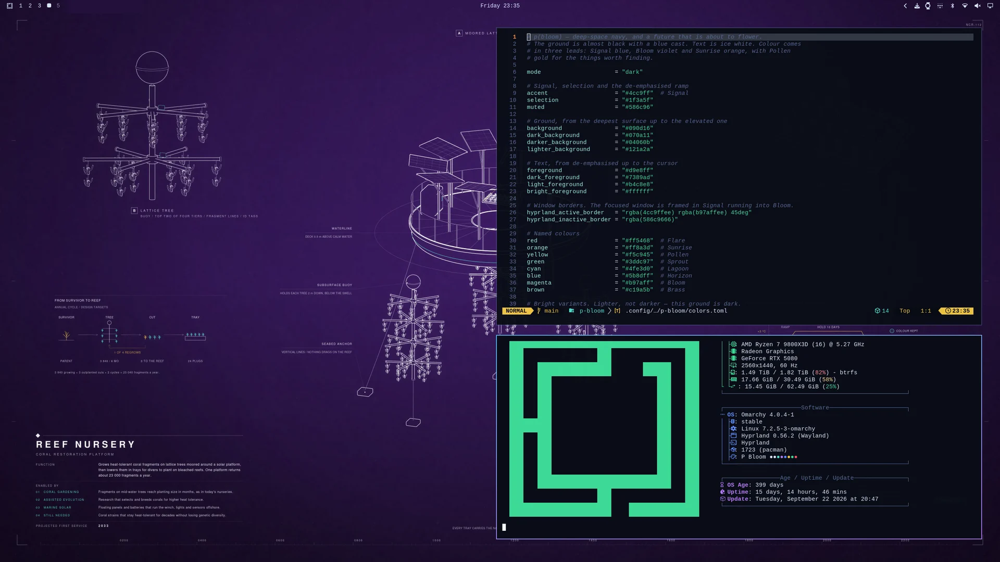

**[▶ Watch the music video (sound on) and read how it was made](https://jacekbecela.com/blog/omarchy-p-bloom-theme/)**

[](https://jacekbecela.com/blog/omarchy-p-bloom-theme/)

**p(bloom) is a theme for [Omarchy](https://omarchy.org).** Deep-space navy, ice-white text, Signal · Bloom · Sunrise. And 42 blueprint wallpapers of machines from a future worth building.

```bash
omarchy theme install https://github.com/ncr/omarchy-p-bloom-theme.git
```

### Composed for your screen, not scaled to it


Each wallpaper is laid out again for 18 screens, from 1080p to 7680 × 2160, in 16:9, 16:10, 3:2, 4:3, 21:9 and 32:9. Backgrounds come in three strengths, Muted, Default and Vivid, with every caption kept readable in each.

### p(bloom) Wallpapers

The companion app is a gallery for the 42 wallpapers: ← → browse, ↑ ↓ show one at another intensity, Enter puts it on your desktop. It also downloads the set made for your monitors and switches when you plug in another screen; after a theme update it fetches only the wallpapers that changed. Open it from Omarchy's menu (Super + Space, type `pbloom`).

```bash
python3 ~/.config/omarchy/themes/p-bloom/companion/install.py
```

Removing the theme (Remove > Theme) removes the app with it. To remove only the app, add `--uninstall`; `--purge` also deletes its downloaded sets and settings.

[What it installs and how it works](companion/README.md)




<sub>[All 42 wallpapers](previews/wallpapers.webp) · [MIT](LICENSE) · Omarchy wordmark from [Omarchy](https://github.com/basecamp/omarchy).</sub>
